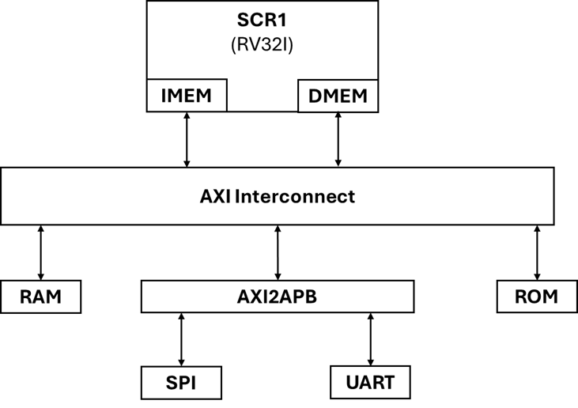

# Amaranth HDL and SystemVerilog SoC Integration

This project demonstrates integrating **Amaranth HDL**, a Python-based hardware description language, with **SystemVerilog** to build a system-on-chip (SoC) design. The goal is to evaluate how well Amaranth can serve as a top-level design language when combining existing SystemVerilog components in a cohesive SoC architecture.

## Project Overview

**Amaranth HDL** offers a flexible approach to hardware design by leveraging Python for high-level abstraction, making code more modular and easier to maintain. However, many complex SoC components—such as CPU cores, interconnects, and peripherals—are commonly developed in SystemVerilog or Verilog. This project investigates the viability and challenges of using Amaranth HDL to manage and integrate these pre-existing SystemVerilog modules within an SoC design.



The SoC in this project includes the following modules:
- **CPU Core**: RISC-V based processor core, cloned from the [SCR1 project](https://github.com/syntacore/scr1)
- **Bus Interconnect**: System bus with AXI protocol support, cloned from the [PULP project](https://github.com/pulp-platform)
- **Memory**: Storage for code and data
- **Peripherals**: UART and SPI, cloned from the [PULP project](https://github.com/pulp-platform)

## Memory mapping

| Slave | Start Address | Size |
|---|---|---|
| RAM | 0x00000000 | 0x100000 |
| APB UART | 0x10000000 | 0x3000 |
| APB SPI Master | 0x20000000 | 0x3000 |
| ROM | 0x50000000 | 0x10000 |

## Prerequisites

Before running the project, ensure you have the following environment variables configured:

***Amaranth HDL*** install from this [link](https://amaranth-lang.org/docs/amaranth/latest/install.html)

## Getting Started
Clone this repository to your local machine:
```
git clone https://github.com/planvtech/SoC_Amaranth.git --recursive
```
Run Simulation
```
make clean
make TESTNAME=<testname> all
```
Replace <test-name> with one of the following test options:
- TestUART
- TestSPIMaster

## Contributing
Contributions to this project are enthusiastically encouraged. If you encounter issues or have enhancements to propose, please initiate an issue or submit a pull request. Ensure compliance with the project's coding standards and guidelines.

## License
This project is licensed under the ---- License. You are free to use, modify, and distribute the code in accordance with the terms stipulated in the license.
